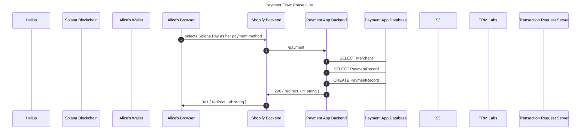
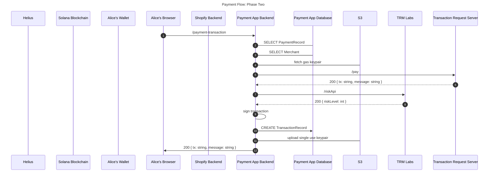
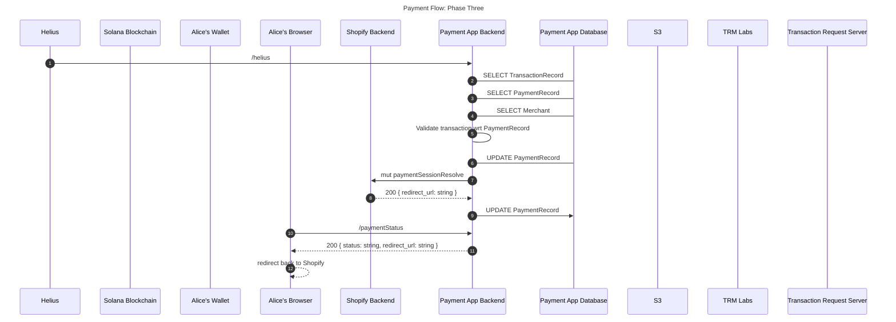
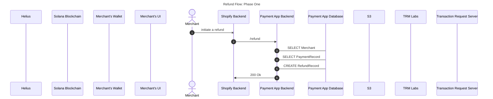
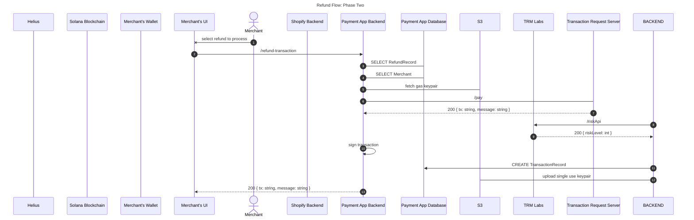
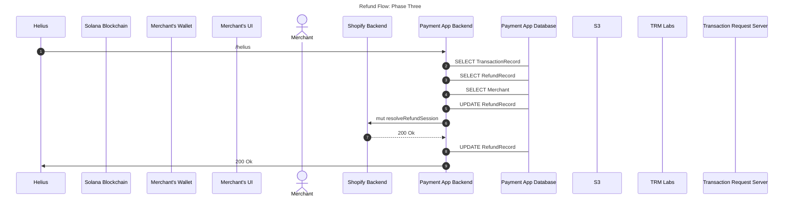
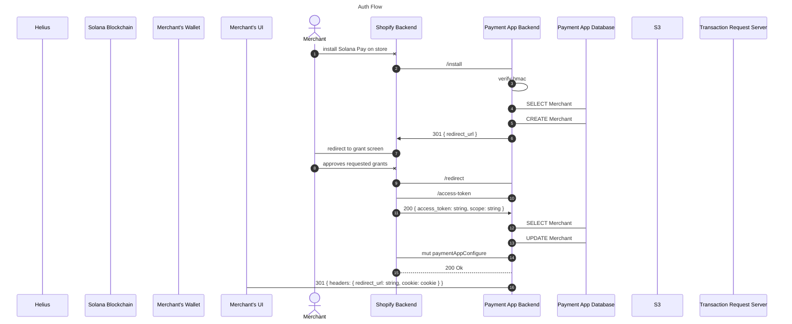

# System Design

Lets explore the Payments app architecture in detail. Our code is available at [Github](https://github.com/solana-labs/solana-payments-app).

## Main Flows

-   Payment Flow
-   Refund Flow
-   Auth Flow

### Payment Flow

The Payment Flow is broken up into three phases.

**Phase One** - Shopify notifies the payment's app backend of a payment that needs to be made. We will respond with a url that the customer can checkout from.

**Phase Two** - The customer requests a payment transaction from the backend.

**Phase Three** - We discover a completed transaction, notify Shopify it's been completed, and send the customer back to Shopify.

### Refund Flow

The Refund Flow is broken up into three phases.

**Phase One** - The merchant initates a refund for a customer. Shopify notifies us of the refund that needs to be proccessed.

**Phase Two** - The merchant starts the process of completing a pending refund on our merchant-ui.

**Phase Three** - We discover a completed transaction. Figure out what refund it's for and notify Shopify it's been completed.

### Auth Flow

## Concepts We Use

### Single Use Accounts

A Single Use Account is an account with 0 data that we add on to transactions. They serve as a solution to a few problems we face when building on chain payment that integrate with web2 commerce platforms. You can view the instruction that handles this [here](https://github.com/solana-labs/solana-payments-app/tree/main/apps/transaction-request-serverless/src/services/builders/create-account-ix.builder.ts).

### Indexing Refrence Keys

We add refrence keys onto transactions for look ups later. Small data < 32 bytes can be made into a public key that only serves as a way to look up the transaction later. We can create keys for things like merchants, payments, and refunds. This will serve as a way to determinstically find transactions if we run into database issues. You can view the instruction that handles this [here](https://github.com/solana-labs/solana-payments-app/tree/main/apps/transaction-request-serverless/src/services/builders/create-account-ix.builder.ts).
