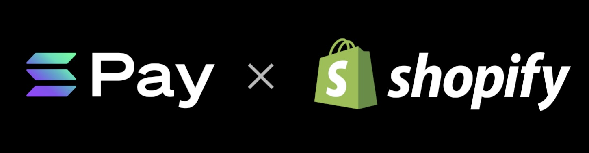

# Solana Pay x Commerce Platforms

    <b>
        <a href="https://commercedocs.solanapay.com">documentation</a>
    </b>
    &nbsp;|&nbsp;
    <b>
        <a href="https://www.youtube.com/channel/UCAbEl-Jr7kx2JqjTjhpoT-Q">walkthroughs</a>
    </b>
    &nbsp;|&nbsp;
    <b>
        <a href="https://apps.shopify.com/solana-pay">installation</a>
    </b>
    &nbsp;|&nbsp;
    <b>
        <a href="https://solanatest1.myshopify.com/">live store</a>
    </b>
    &nbsp;|&nbsp;
    <b>
        <a href="https://merchant.solanapay.com">merchant login</a>
    </b>
    &nbsp;|&nbsp;
    <b>
        <a href="./merchants/onboarding">merchant login</a>
    </b>
    &nbsp;|&nbsp;
     
    <a href="https://solanatest8.myshopify.com">staging store</a>
    &nbsp;|&nbsp;
    <a href="https://merchant-staging.solanapay.com">demo staging merchant login</a>

## Transact on Shopify with Solana pay

-   **Easy set-up:** Start accepting USDC payments right away.
-   **Stable payments:** Transactions occur in USDC, a US dollar-pegged stablecoin.
-   **Minimal fees:** A cost-effective alternative to traditional payment rails.
-   **Fast processing:** Take advantage of Solana's near-instant settlement time.
-   **Web3 Loyalty:** Enable web3-native interactions like loyalty programs and more.

## About

Solana pay is currently setup with Shopify, and allows integration with your Shopify store. It allows merchants to accept crypto (USDC for now), and offer loyalty programs to their customers.

For the customer, the process is straightforward. At checkout, they would select Solana Pay, connect their Solana wallet, and approve the transaction. This process is designed to be fast, secure, and user-friendly.

Security is a top priority for Solana Pay. We do not store personal data about customers beyond their onchain activity (wallet addresses and USDC spent).

If you need assistance or have any questions, please reach out to us at commerce@solana.com. You can also visit our [support page](https://merchant.solanapay.com/support) for more information.
