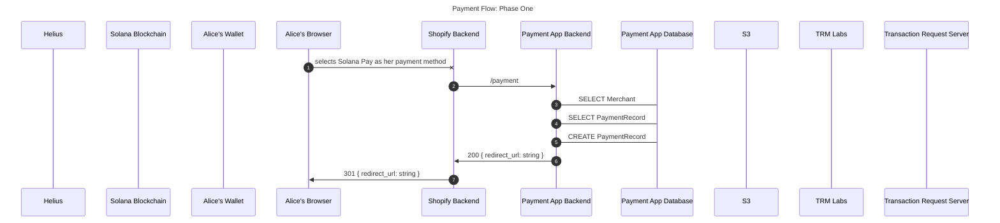
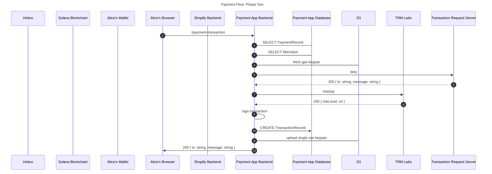
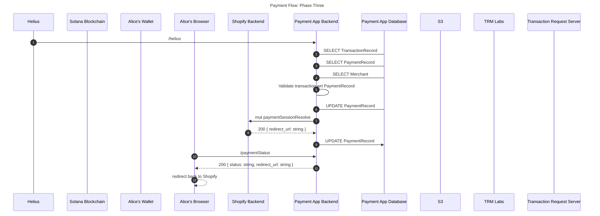
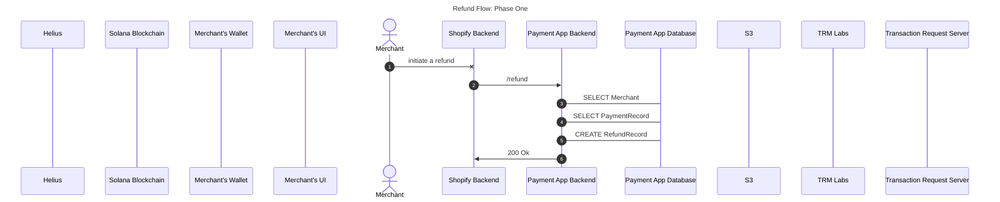
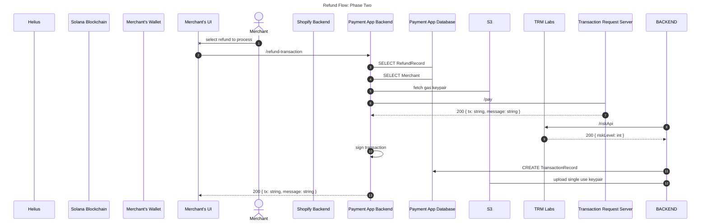
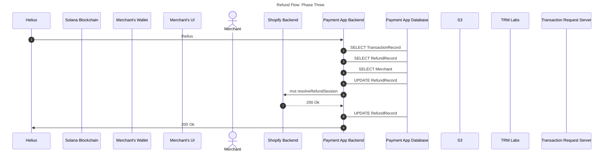
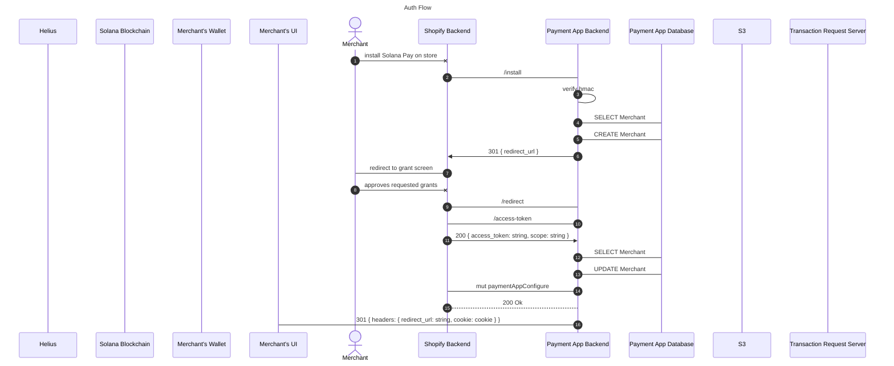

# Payments App System Design

This doc should serve as the starting point of the system design for the Solana Payment App.

Note: Given we are in the very early stages of development, this should change over time with the build out.

## Components

-   Backend - Orcastration logic that connects merchants to consumers who want to complete a payment over the Solana network and handles the communication with Shopify as a side effect of the actions taken
-   Mertchant UI - General merchant managment portal
-   Payment UI - UI for completing a payment on Solana, lightly coupled to the Solana Payments Appp
-   Transaction Request Server - Generalized transaction building engine for payments

## Main Flows

-   Payment Flow
-   Refund Flow
-   Auth Flow

### Payment Flow

The Payment Flow is broken up into three phases.

**Phase One** - Shopify notifies the payment's app backend of a payment that needs to be made. We will respond with a url that the customer can checkout from.

**Phase Two** - The customer requests a payment transaction from the backend.

**Phase Three** - We discover a completed transaction, notify Shopify it's been completed, and send the customer back to Shopify.

### Refund Flow

The Refund Flow is broken up into three phases.

**Phase One** - The merchant initates a refund for a customer. Shopify notifies us of the refund that needs to be proccessed.

**Phase Two** - The merchant starts the process of completing a pending refund on our merchant-ui.

**Phase Three** - We discover a completed transaction. Figure out what refund it's for and notify Shopify it's been completed.

### Auth Flow

## Database Schema

### Merchant

|            name            |  type  |                 notes                 |
| :------------------------: | :----: | :-----------------------------------: |
|             id             |  Int   |           Autogenerated ID            |
|            name            | String |             Display Name              |
|            shop            | String |          Shopify Merhcant Id          |
|        accessToken         | String |         Shopify Access Token          |
|           scopes           | String |      Most Recent Shopify Scopes       |
|         lastNonce          | String |        Most Recent Auth Nonce         |
|       paymentAddress       | String |         Destination for funds         |
|       paymentAddress       | String |      USDC destination for funds       |
| acceptedTermsAndConditions | String |     flag for terms and conditions     |
|      dismissCompleted      | String | flag for dismissing completed message |

### PaymentRecord

|         name         |  type   |                            notes                            |
| :------------------: | :-----: | :---------------------------------------------------------: |
|        status        | String  |              tracks the progress of a payment               |
|      merchantId      | String  |              links the merchant to the payment              |
|        amount        | Number  | how much fiat the payment was for in the currency specified |
|       currency       | String  |             currency that the amount specifies              |
|      usdcAmount      | Number  |         amount and currency converted to USDC price         |
|        shopId        | String  |            'id' value passed to us from shopify             |
|       shopGid        | String  |            'gid' value passed to us from shopify            |
|      shopGroup       | String  |           'group' value passed to us from shopify           |
|         test         |  Bool   |            payment is just for merchant testing             |
|          id          | String  |                     internal unique id                      |
|      cancelURL       | String  |        location to send the customer if they cancel         |
|     redirectURL      | String  |       success URL to send a customer to when they pay       |
| transactionSignature | String? |      links the payment to the transaction that paid it      |

### RefundRecord

|         name         |  type   |                           notes                            |
| :------------------: | :-----: | :--------------------------------------------------------: |
|        status        | String  |              tracks the progress of a refund               |
|      merchantId      | String  |              links the merchant to the refund              |
|        amount        | String  | how much fiat the refund was for in the currency specified |
|       currency       | String  |             currency that the amount specifies             |
|      usdcAmount      | Number  |        amount and currency converted to USDC price         |
|        shopId        | String  |            'id' value passed to us from shopify            |
|       shopGid        | String  |           'gid' value passed to us from shopify            |
|    shopPaymentId     | String  |        'payment_id' value passed to us from shopify        |
|         test         |  Bool   |            refund is just for merchant testing             |
|          id          | String  |                     internal unique id                     |
| transactionSignature | String? |      links the refund to the transaction that paid it      |

### TransactionRecord

|      name       |  type   |                     notes                      |
| :-------------: | :-----: | :--------------------------------------------: |
|    signature    | String  |             transaction Signature              |
|      type       | String  |             'payment' or 'refund'              |
|    createdAt    | String  | timestamp the transaction was built and signed |
| paymentRecordId | String? |      links the transaction to the payment      |
| refundRecordId  | String? |      links the transaction to the refund       |

## Novel Concepts We Use

### Single Use Accounts

A Single Use Account is an account with 0 data that we add on to transactions. They serve as a solution to a few problems we face when building on chain payment that integrate with web2 commerce platforms. You can view the instruction that handles this [here](https://github.com/solana-labs/solana-payments-app/tree/main/apps/transaction-request-serverless/src/services/builders/create-account-ix.builder.ts).

### Indexing Refrence Keys

We add refrence keys onto transactions for look ups later. Small data < 32 bytes can be made into a public key that only serves as a way to look up the transaction later. We can create keys for things like merchants, payments, and refunds. This will serve as a way to determinstically find transactions if we run into database issues. You can view the instruction that handles this [here](https://github.com/solana-labs/solana-payments-app/tree/main/apps/transaction-request-serverless/src/services/builders/create-account-ix.builder.ts).
