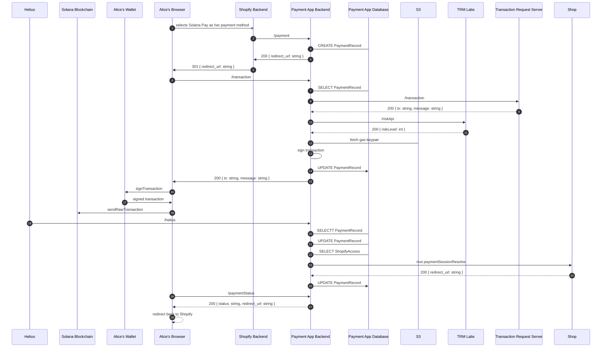

# Payments App System Design

This doc should serve as the starting point of the system design for the Solana Payment App.

Note: Given we are in the very early stages of development, this should change over time with the build out.

## Components

The Solana Payments App is designed around a few pieces of software that work together

1. Backend App - Orcastration logic that connects merchants -> consumers who want to complete a payment over the Solana network
2. Mertchant UI - General merchant managment portal
3. Payment UI - UI for completing a payment on Solana, lightly coupled to the Solana Payments Appp
4. Transaction Request Server - Generalized transaction building engine for payments
5. Commerce Protocol - Lightweight on chain entities and actions to paticipate in commerce

## System Design Goals.

-   Serve multiple platforms with reuable infrastructure. Some platoforms may use all of the infrastruture, some may only use parts. For example, a point of sale may avoid the payment ui and replace that with their own, client side ui.
-   Easy to redeploy and host your own instance of the payments app.
-   Leverage Solana where possible to remove dependecies of hosted services.

