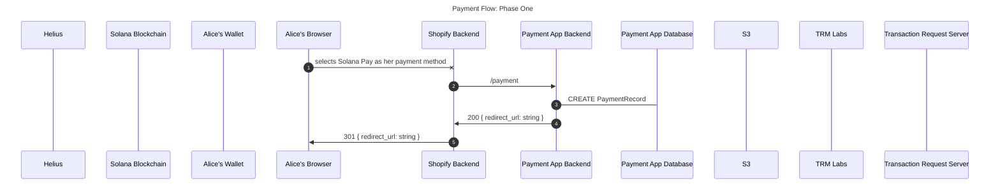
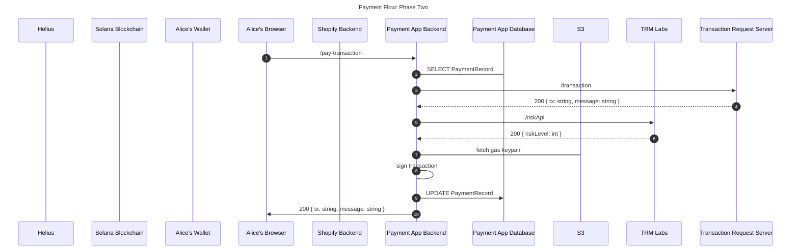
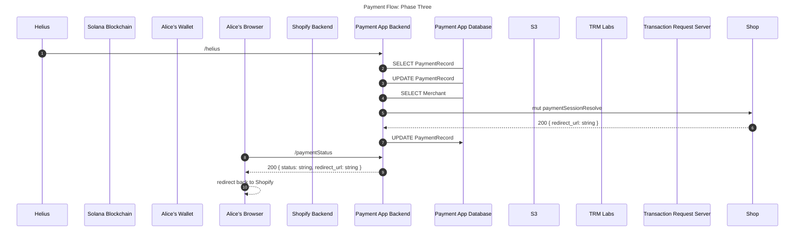
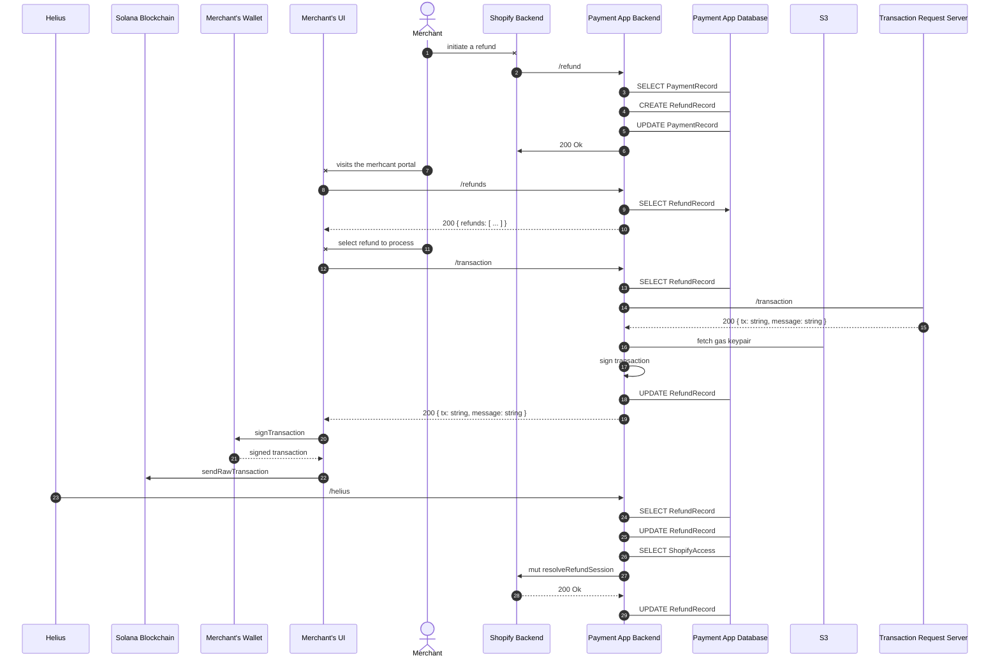

# Payments App System Design

This doc should serve as the starting point of the system design for the Solana Payment App.

Note: Given we are in the very early stages of development, this should change over time with the build out.

## Components

-   Backend - Orcastration logic that connects merchants to consumers who want to complete a payment over the Solana network
-   Mertchant UI - General merchant managment portal
-   Payment UI - UI for completing a payment on Solana, lightly coupled to the Solana Payments Appp
-   Transaction Request Server - Generalized transaction building engine for payments

## System Design Goals

-   Serve multiple platforms with reusable infrastructure
-   Leverage Solana where possible to remove dependecies on hosted services
-   Easy to deploy and host your own instance of the payments app

## Main Flows

-   Payment Flow
-   Refund Flow
-   Auth Flow

### Payment Flow

The Payment Flow is broken up into three phases.

Phase One: Shopify notifies the payment's app backend of a payment that needs to be made. We will respond with a url that the customer can checkout from.

Phase Two: The customer requests a payment transaction from the backend.

Phase Three: We discover a completed transaction, notify Shopify it's been completed, and send the customer back to Shopify.

### Refund Flow

## Database Schema

### Shopify Access

|    name     |  type  |               notes               |
| :---------: | :----: | :-------------------------------: |
|     id      |  Int   |         Autogenerated ID          |
| accessToken | String |            Auth Token             |
|   scopes    | String | Scopes returned with access token |

### Payment Record

|   name    |  type  |               notes               |
| :-------: | :----: | :-------------------------------: |
| paymentId | String |        Given From Shopify         |
| shopifyId | String |            Auth Token             |
|  amount   | String | Scopes returned with access token |
